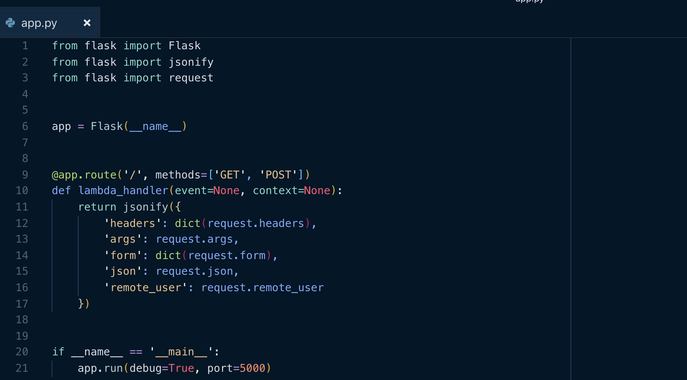
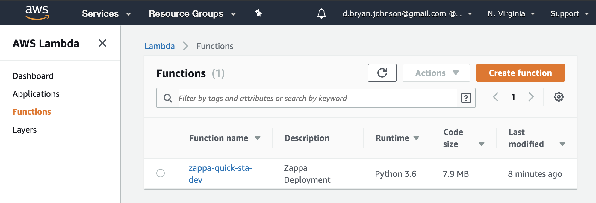
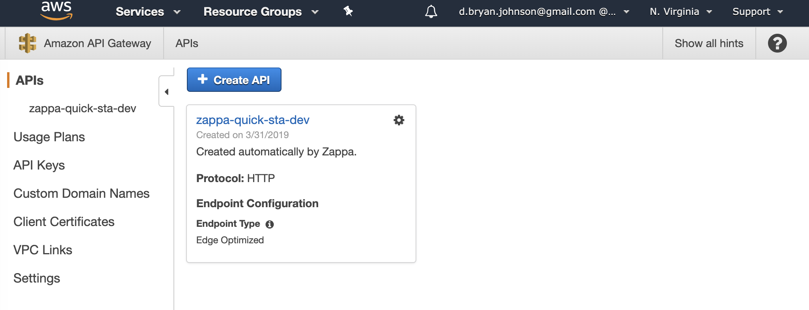
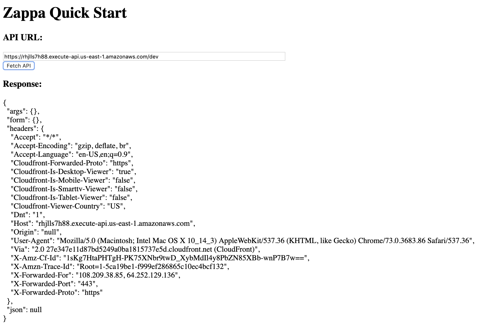
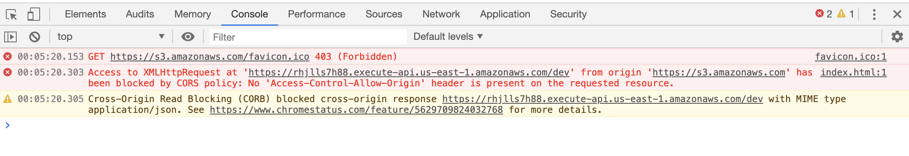
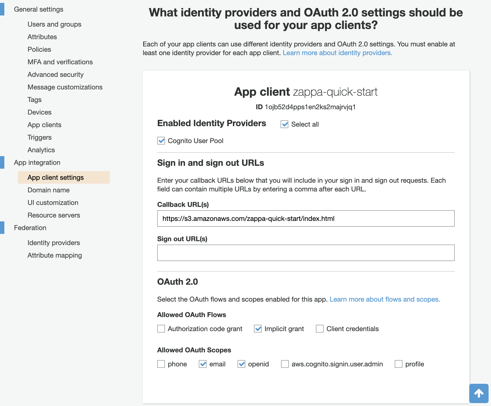
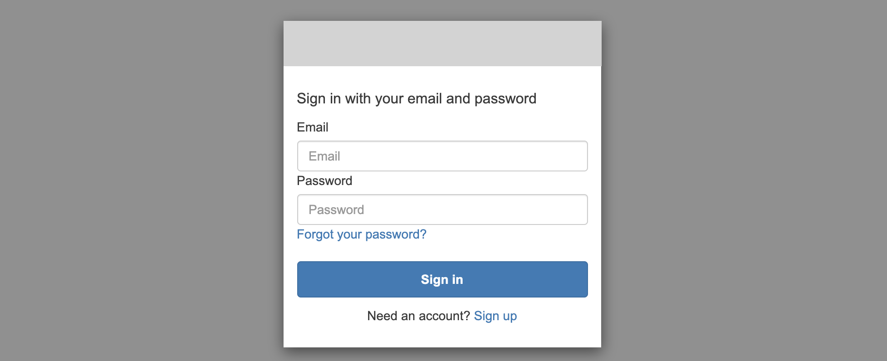
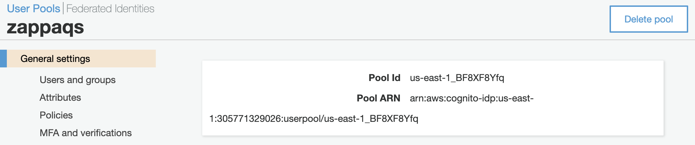
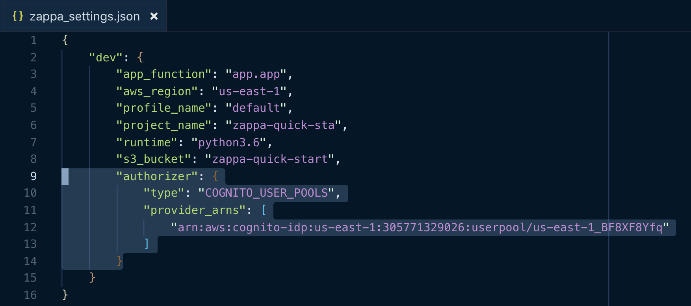

# Zappa Quick Start

## Intent
This repo is intended to serve as a quick walkthrough for setting up a new serverless app using [zappa](https://github.com/Miserlou/Zappa), including authentication via [cognito](https://aws.amazon.com/cognito/).  Zappa's docs are excellent, but I was not familiar with some basics required for auth in the AWS ecosystem, including [AWS API gateway](https://aws.amazon.com/api-gateway/), and there's some messy [CORS](https://en.wikipedia.org/wiki/Cross-origin_resource_sharing) stuff, and so it took a couple of days of searching for me to put all the pieces together.  So, I'm leaving my notes here in case they might be helpful to others.

If you're brand new to serverless, please check out my friend [Dane Hillard](https://github.com/daneah)'s intro from [Djangocon 2018](https://www.youtube.com/watch?v=ZfynWM4-jFE).

### What we'll make
By the end of this guide, we will have:

* A simple [flask](http://flask.pocoo.org/) API 
	* deployed as an [AWS lambda](https://aws.amazon.com/lambda/) function
	* configured and managed via [zappa](https://github.com/Miserlou/Zappa)
	* with authorization managed by [cognito](https://aws.amazon.com/cognito/)
* A simple webapp ([live demo](https://s3.amazonaws.com/zappa-quick-start/index.html)) that handles user authentication and interacts with the serverless API.
* And a bunch of links to articles and resources


We'll break this into four main sections:

1. [Setting up the flask app and testing locally](#1-flask-api)
2. [Deploying the API to AWS via Zappa](#2-deploy-as-lambda-via-zappa)
3. [Accessing the API via webapp](#3-accessing-the-api-via-webapp)
4. [Securing the API](#4-securing-the-api)

Ready? Let's go!

## 1. Flask API
This API ([app.py](app.py)) will have a single route, `/`, that simply echoes back request parameters and data payloads:


### Install requirements
[requirements.txt](requirements.txt) has just 2 dependencies - zappa and flask.  Let's set up a [virtual enviroment](https://realpython.com/python-virtual-environments-a-primer/) and install them:

```bash
$ python3 -m venv .VENV
$ source .VENV/bin/activate
$ pip install -r requirements.txt
```

### Run the API locally
```bash
$ python3 app.py
```

### Query via CURL

```bash
$ curl http://127.0.0.1:5000/\?foo\=bar
```

```json
{
  "args": {
    "foo": "bar"
  },
  "form": {},
  "headers": {
    "Accept": "*/*",
    "Host": "127.0.0.1:5000",
    "User-Agent": "curl/7.54.0"
  },
  "json": null
}
```

## 2. Deploy as Lambda via Zappa
### Set up your AWS credentials

```bash
$ python3 -m pip install awscli
$ aws configure
```
### Zappa init
```bash
$ zappa init
```
... follow the prompts

### Zappa deploy
```bash
$ zappa deploy dev
```
(replace `dev` with appropriate name if you chose a different environment name)

### Test it!
If the deploy command above worked, the last line of the output should indicate the URL for the deployed service.  Let's curl it (url below is specific to my deploy, please replace with your own value)

```bash
$ curl https://rhjlls7h88.execute-api.us-east-1.amazonaws.com/dev?foo=bar
```
```json
{"args":{"foo":"bar"},"form":{},"headers":{"Accept":"*/*","Cloudfront-Forwarded-Proto":"https","Cloudfront-Is-Desktop-Viewer":"true","Cloudfront-Is-Mobile-Viewer":"false","Cloudfront-Is-Smarttv-Viewer":"false","Cloudfront-Is-Tablet-Viewer":"false","Cloudfront-Viewer-Country":"US","Host":"rhjlls7h88.execute-api.us-east-1.amazonaws.com","User-Agent":"curl/7.54.0","Via":"2.0 2071c0eda1d5bdc94fe89ed529cdd7be.cloudfront.net (CloudFront)","X-Amz-Cf-Id":"ps3Y4UWGUc_CITG2MUhKR_oFC1i0dqzdEJE1KbWmImgGkfpLjjdeMQ==","X-Amzn-Trace-Id":"Root=1-5ca15d39-a71df92853407722169fd298","X-Forwarded-For":"108.209.38.85, 70.132.5.163","X-Forwarded-Port":"443","X-Forwarded-Proto":"https"},"json":null}
```
Okay, you should see the same `"args":{"foo":"bar"}`, and a bunch of new headers automatically injected by [CloudFront](https://aws.amazon.com/cloudfront), AWS's content delivery network.  

## What just happened?
Zappa just did a bunch of work behind the scenes.  Mainly, it created a new lambda function and API gateway to manage access to it.  You can see these by navigating to the lambda and API gateway services in the AWS console.  Mine look like this:




This is all great, but if you're doing anything non-trivial, you probably need to manage access to your API.  Right now anyone with an internet connection can hit it!

## 3. Accessing the API via webapp
The demo webapp ([index.html](webapp/index.html)) simply makes a `GET` call to this API, and displays the response.



However, first we have to deal with [CORS](https://en.wikipedia.org/wiki/Cross-origin_resource_sharing).  CORS issues are common in serverless setups with static webapps hosted separately from the API (e.g., on S3).  So, we have to configure the server to set the `Access-Control-Allow-Origin` header on responses to allow the webapp origin.

Zappa claims to support CORS response headers with a [simple config switch](https://github.com/Miserlou/Zappa#enabling-cors), but I had no luck getting that to work despite several hours trying.  I was repeatedly met with the following errors in the console:



The `GET` responses did not include the requisite `Access-Control-Allow-Origin` header.  Responses to "pre-flight" `OPTIONS` requests (forced, if necessary, by setting a request header that triggers it - see [here](https://developer.mozilla.org/en-US/docs/Web/HTTP/CORS#Simple_requests)), did include them, but that's not good enough.

Zappa [docs](https://github.com/Miserlou/Zappa#enabling-cors) point out that CORS might be better handled directly in the api code itself via [flask-cors](https://github.com/corydolphin/flask-cors).  This is super simple to set up, and it worked like a charm for me.  

**Note:** although zappa [docs](https://github.com/Miserlou/Zappa#enabling-cors) describe [flask-cors](https://github.com/corydolphin/flask-cors) as an alternative method, I still had to leave the `cors` flag set to true in [zappa_settings.json](zappa_settings.json) in the end.  


## 4. Securing the API

Now, if you just want to require an API key, zappa supports that really easily [out of the box](https://github.com/Miserlou/Zappa#api-key).  However, if you want to manage access at the user level, perhaps even via external identity providers (e.g., OAuth), you'll need a way to fetch an access token after user identity has been verified.  Cognito makes this pretty easy.


### Quick & dirty Cognito setup
We'll use cognito to manage access.  A full cognito tutorial is beyond the scope of this doc, but the basics are that we'll create a new user pool, and allow users to self-register.  The basics from AWS set up to do just that.  Just nagivate to cognito via the AWS services menu, and add a new user pool.

Once you've created your user pool, create a new "App client" via `General settings > App clients` - this allows us to set up different rules for accessing various services via one user pool.  Again, the defaults here are fine.

Next, fill out the information in `App integration > App client settings`:


Important things to note here:

1.  You must provide a callback URL - the is the URL your browser will be redirected to after authentication is complete.  The post-auth redirect request will include an authentication token that the client can then use to interact with the API (after we've locked it down)
2. Your call back URL must use https!  For exploratory purposes, you can simply drop an index.html at s3, make it public, and point the redirect directly to the https s3 file link.  Ultimately, you're going to want to setup your own domain and SSL certs, etc, if you haven't already.  Here's a [decent primer](https://medium.freecodecamp.org/simple-site-hosting-with-amazon-s3-and-https-5e78017f482a) on how to do that easily in s3.
3. The selected OAuth flow should be `implicit grant`.  This means cognito will provide an access token directly in the parameters of the post-auth redirect request.

Finally, choose the domain for your login page under `App integration > Domain name`

### Testing authentication
After you've finished user pool setup, give it a test run.  The login page will be accessible here:

`https://{AUTH_DOMAIN}/login?response_type=token&client_id={APP_CLIENT_ID}&redirect_uri={POST_AUTH_CALLBACK_URL}`

Note that all the variables in the url model above are available directly in the user pool settings.  In our case, the URL looks like this:


[https://zappaqs.auth.us-east-1.amazoncognito.com/login?response_type=token&client_id=1ojb52d4pps1en2ks2majrvjq1&redirect_uri=https://s3.amazonaws.com/zappa-quick-start/index.html](https://zappaqs.auth.us-east-1.amazoncognito.com/login?response_type=token&client_id=1ojb52d4pps1en2ks2majrvjq1&redirect_uri=https://s3.amazonaws.com/zappa-quick-start/index.html)

If everything is set up correctly, you should see a page that looks like this:


Cognito allows you to style / brand this page via `App integration > UI customization	`

### Lock the API down
Now, we'll tell Zappa that we're using Cognito to secure the API.  All Zappa needs to know is the user pool ARN, which can be found in Cognito under general settings for the pool: 


Now, put that ARN in [zappa_settings.json](zappa_settings.json) like so:


And update the deployment:

```bash
$ zappa update dev
```

### Using auth tokens to access the secured API

Our demo webapp ([index.html](webapp/index.html)) uses the [AWS Cognito JS SDK](https://github.com/aws/amazon-cognito-auth-js) to authenticate via Cognito, then injects the associated auth token into the API request - just take a quick read through.  Easy!  Note that the demo webapp was written using jQuery just to make the lightest weight possible demo, and closely follows the example in the [AWS Cognito JS SDK repo](https://github.com/aws/amazon-cognito-auth-js).  Take a read through their docs for use with npm/webpack.

## That's all, folks!
Thanks for reading!  I hope this walkthrough has been helpful.  Please do see the [official Zappa docs](https://github.com/Miserlou/Zappa) - there's a ton you can do with this library!  If you have any questions or suggestions on these notes, please open an [issue](https://github.com/dbjohnson/zappa-quick-start/issues) or [PR](https://github.com/dbjohnson/zappa-quick-start/pulls).
